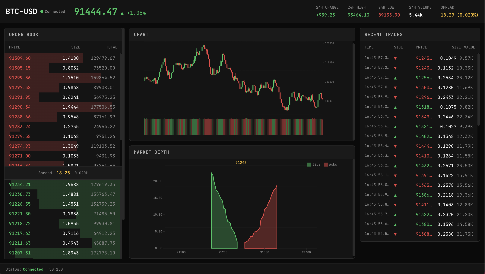

# Cryptocurrency Tx Exchange Dash (Rust)
Trading Exchange Cryptocurrency (BTC) Tx Service w/ Dash UI using Rust, Rust Tokio Asyc, Rust Leptos WASM Toolkit and Canvas.

```
██████╗ ████████╗ ██████╗    ██████╗  █████╗ ███████╗██╗  ██╗
██╔══██╗╚══██╔══╝██╔════╝    ██╔══██╗██╔══██╗██╔════╝██║  ██║
██████╔╝   ██║   ██║         ██║  ██║███████║███████╗███████║
██╔══██╗   ██║   ██║         ██║  ██║██╔══██║╚════██║██╔══██║
██████╔╝   ██║   ╚██████╗    ██████╔╝██║  ██║███████║██║  ██║
╚═════╝    ╚═╝    ╚═════╝    ╚═════╝ ╚═╝  ╚═╝╚══════╝╚═╝  ╚═╝
```


---




---


## Architecture

```
┌─────────────────────────────────────────────────────────────────────────┐
│                         BROWSER (WASM Runtime)                          │
│  ┌───────────────────────────────────────────────────────────────────┐  │
│  │                       dash-app (Leptos CSR)                       │  │
│  │  ┌─────────────┐  ┌──────────────┐  ┌──────────────────────────┐  │  │
│  │  │ dash-state  │  │dash-websocket│  │    dash-components       │  │  │
│  │  │  (Signals)  │◄─┤    (gloo)    │  │    (Leptos Views)        │  │  │
│  │  └──────┬──────┘  └──────┬───────┘  └───────────┬──────────────┘  │  │
│  │         │                │                      │                 │  │
│  │         └────────────────┼──────────────────────┘                 │  │
│  │                          │                                        │  │
│  │              ┌───────────▼────────────┐                           │  │
│  │              │       dash-charts      │                           │  │
│  │              │   (SVG/Canvas Render)  │                           │  │
│  │              │      + chartkit.rs     │                           │  │
│  │              └───────────┬────────────┘                           │  │
│  │                          │                                        │  │
│  │              ┌───────────▼────────────┐                           │  │
│  │              │        dash-core       │                           │  │
│  │              │     (Domain Types)     │                           │  │
│  │              └────────────────────────┘                           │  │
│  └───────────────────────────────────────────────────────────────────┘  │
└─────────────────────────────────────────────────────────────────────────┘
                               │ WebSocket
                               ▼
┌─────────────────────────────────────────────────────────────────────────┐
│                       SERVER (dash-server)                              │
│  ┌──────────────────┐  ┌──────────────────┐  ┌──────────────────────┐   │
│  │    Axum Router   │  │  WS Broadcaster  │  │   Mock Data Engine   │   │
│  └──────────────────┘  └──────────────────┘  └──────────────────────┘   │
└─────────────────────────────────────────────────────────────────────────┘
```


## Crate Dependency Graph

```
dash-app
├── dash-components
│   ├── dash-charts ──► dash-core
│   ├── dash-state ───► dash-core  
│   └── dash-core
├── dash-websocket
│   ├── dash-state
│   └── dash-core
└── dash-state
    └── dash-core
```


## Design System

### Color Palette (Trading Terminal Aesthetic)

| Variable           | Hex       | Usage                    |
|--------------------|-----------|--------------------------|
| `--bg-void`        | `#0a0a0a` | Primary background       |
| `--bg-panel`       | `#141414` | Panel backgrounds        |
| `--bg-elevated`    | `#1a1a1a` | Elevated surfaces        |
| `--border-subtle`  | `#2a2a2a` | Subtle borders           |
| `--text-primary`   | `#fafafa` | Primary text             |
| `--text-muted`     | `#888888` | Muted text               |
| `--accent-bull`    | `#22c55e` | Buy/Bull (green)         |
| `--accent-bear`    | `#ef4444` | Sell/Bear (red)          |
| `--accent-warn`    | `#fbbf24` | Warnings/Highlights      |
| `--accent-info`    | `#e5e5e5` | Neutral info (light grey)|


## Project Structure

```shell
crytptocurrency-tx-exchange-dash-rs/
├── Cargo.toml                          # Workspace manifest
├── README.md                           # Docs + Firecracker migration path
│
├── crates/
│   ├── dash-core/                      # Domain types (Trade, OrderBook, Candle, Ticker)
│   │   ├── Cargo.toml
│   │   └── src/
│   │       ├── lib.rs
│   │       ├── trade.rs
│   │       ├── order.rs
│   │       ├── candle.rs
│   │       └── ticker.rs
│   │
│   ├── dash-state/                     # Leptos signals & reactive state
│   │   ├── Cargo.toml
│   │   └── src/
│   │       ├── lib.rs
│   │       └── market.rs
│   │
│   ├── dash-charts/                    # D3-style SVG charts
│   │   ├── Cargo.toml
│   │   └── src/
│   │       ├── lib.rs
│   │       ├── candlestick.rs
│   │       ├── depth.rs
│   │       ├── sparkline.rs
│   │       └── chartkit.rs
│   │
│   ├── dash-websocket/                 # WebSocket client
│   │   ├── Cargo.toml
│   │   └── src/
│   │       ├── lib.rs
│   │       └── client.rs
│   │
│   ├── dash-components/                
│   │   ├── Cargo.toml
│   │   └── src/
│   │       ├── lib.rs
│   │       ├── order.rs            
│   │       ├── trade_history.rs        
│   │       ├── ticker_bar.rs           
│   │       └── dashboard.rs            
│   │
│   └── dash-app/                       
│       ├── Cargo.toml
│       ├── Trunk.toml
│       ├── index.html
│       └── src/
│           └── main.rs
│
├── server/
│   └── dash-server/                    # Axum WebSocket server
│       ├── Cargo.toml
│       └── src/
│           ├── main.rs
│           ├── ws.rs
│           └── mock.rs
│
├── deploy/
│   ├── firecracker/                    
│   │   ├── vm-config.json
│   │   └── setup.sh
│   └── docker/                         
│       ├── Dockerfile.frontend
│       ├── Dockerfile.server-end
│       └── docker-compose.yml
│
└── static/
    └── css/
        └── theme.css                   
```


---

## Quick Start (MacOS)

### Prerequisites

```bash
# Install Rust
curl --proto '=https' --tlsv1.2 -sSf https://sh.rustup.rs | sh

# Add WASM target
rustup target add wasm32-unknown-unknown

# Install Trunk (WASM bundler)
cargo install trunk

# Install cargo-watch for hot reload
cargo install cargo-watch
```

### Run Development

```bash
# Terminal 1: Backend WebSocket server
cd server/dash-server
cargo run

# Terminal 2: Frontend with hot reload
cd crates/dash-app
trunk serve --open
```

Dashboard: `http://127.0.0.1:8080`


### Production Build

```bash
cd crates/dash-app
trunk build --release
# Output: crates/dash-app/dist/
```


### Using Project Makefile
```shell
# Unzip and enter project
unzip btc-exchange-dash-complete.zip
cd btc-exchange-dash

# Install dependencies (one time)
make install-deps

# Build everything
make build

# See what happens
make help
```

---

### Makefile Commands

```shell
BTC Exchange Dashboard
======================

Setup:
  install-deps       Install all dependencies
  install-wasm       Install WASM target
  install-trunk      Install trunk bundler

Development:
  dev                Start development environment (server + frontend)
  server             Run backend server
  frontend           Run frontend dev server
  watch-server       Run server with auto-reload
  watch-frontend     Run frontend with hot reload

Build:
  build              Build all crates (debug)
  release            Build optimized release
  build-server       Build server only
  build-frontend     Build WASM frontend
  build-static       Build static server binary (musl)

Quality:
  test               Run all tests
  fmt                Format code
  lint               Run clippy lints
  check              Quick check (no codegen)
  ci                 Run all CI checks

Deploy:
  docker             Build and run Docker containers
  docker-build       Build Docker images
  firecracker-build  Build for Firecracker

Cleanup:
  clean              Clean build artifacts
  clean-all          Clean everything
```

### Run the BTC Dash UI 

```shell
make install-deps or make install-trunk
make build
```
or 

```shell
make install-deps or make install-trunk
# Terminal 1
make server

# Terminal 2
make frontend
```

Then open http://127.0.0.1:8080 and see the trading dashboard with mock BTC data streaming in real-time.


---

## Transition Path: Firecracker on Linux

> **Firecracker requires KVM** — Linux ONLY

### Architecture Overview

```
┌──────────────────────────────────────────────────────────────────┐
│                 Linux Host (AWS EC2, bare metal)                 │
│  ┌────────────────────────────────────────────────────────────┐  │
│  │                    Firecracker MicroVM                     │  │
│  │  ┌──────────────────────────────────────────────────────┐  │  │
│  │  │               dash-server (Axum)                     │  │  │
│  │  │          WebSocket + Static File Server              │  │  │
│  │  └──────────────────────────────────────────────────────┘  │  │
│  │  ┌──────────────────────────────────────────────────────┐  │  │
│  │  │             dist/ (WASM bundle)                      │  │  │
│  │  │          index.html + *.wasm + *.js                  │  │  │
│  │  └──────────────────────────────────────────────────────┘  │  │
│  └────────────────────────────────────────────────────────────┘  │
└──────────────────────────────────────────────────────────────────┘
```

### Step 1: Build Static Binary

```bash
# Cross-compile for musl (static linking)
rustup target add x86_64-unknown-linux-musl

cd server/dash-server
RUSTFLAGS='-C target-feature=+crt-static' \
cargo build --release --target x86_64-unknown-linux-musl
```

### Step 2: Create Root Filesystem

```bash
# Create minimal Alpine rootfs
mkdir -p /tmp/rootfs
docker export $(docker create alpine:3.19) | tar -C /tmp/rootfs -xf -

# Copy binary and WASM dist
cp target/x86_64-unknown-linux-musl/release/dash-server /tmp/rootfs/usr/bin/
cp -r crates/dash-app/dist /tmp/rootfs/var/www/

# Create ext4 image
dd if=/dev/zero of=rootfs.ext4 bs=1M count=256
mkfs.ext4 rootfs.ext4
mkdir -p /mnt/rootfs
mount rootfs.ext4 /mnt/rootfs
cp -a /tmp/rootfs/* /mnt/rootfs/
umount /mnt/rootfs
```

### Step 3: Start Firecracker

```bash
# Create tap device
sudo ip tuntap add tap0 mode tap
sudo ip addr add 172.16.0.1/24 dev tap0
sudo ip link set tap0 up

# Start Firecracker
sudo firecracker \
    --api-sock /tmp/firecracker.sock \
    --config-file deploy/firecracker/vm-config.json

# VM accessible at 172.16.0.2:3000
```

### Alternative: WASM Runtime in Firecracker

For edge compute / server-side WASM:

```bash
# In Firecracker VM
curl https://wasmtime.dev/install.sh -sSf | bash

# Compile as WASI target
rustup target add wasm32-wasip1
cargo build --target wasm32-wasip1 --release

# Run in wasmtime
wasmtime --dir=. target/wasm32-wasip1/release/dash_app.wasm
```

---


## License

MIT License — EngineVector © 2025
